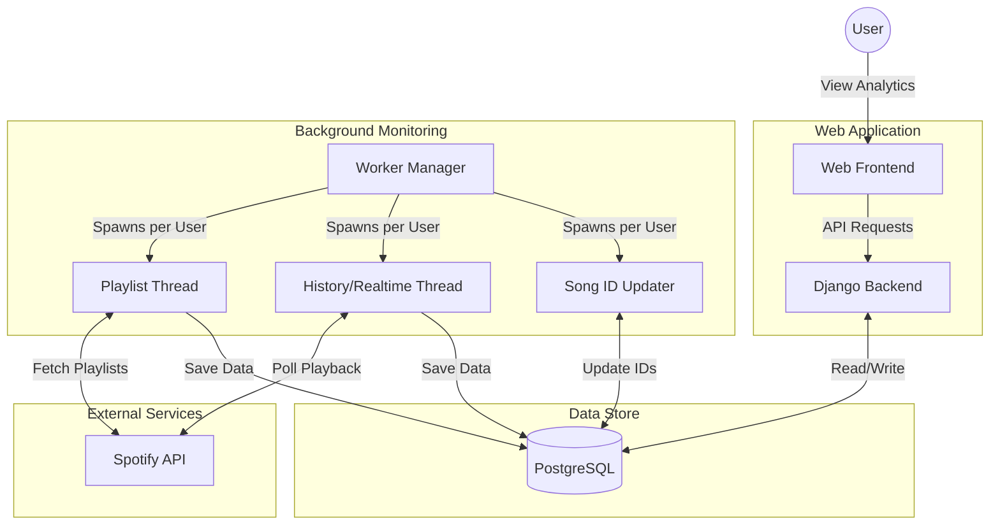

# Analytics for Spotify

**Production:**  

**Develop:**  

## Work In Progress

Self Hosted Last.FM Alternative to keeping track of your Spotify History

Current Features:

- Keeps Track of Listening History
- Keeps Track of How Many Times a Song is Played
- Ability to View Unplayable Songs in a Spotify Playlist
- Includes Local Files (Hybrid & Realtime Scanning)
- Upload Historical Songs From [Spotify Dump](https://www.spotify.com/us/account/privacy/)

Notes:

- Ignores Scrubbing Through Songs (Counts as one Play)
- Requires Spotify Developer App to be Created

### Internal Site / Local Network Use Only

Not Designed to be Public / Internet Facing.

## Tech Stack

- **Backend**: Django (Python)
- **Database**: PostgreSQL
- **Frontend**: HTML, CSS, JavaScript
- **Containerization**: Podman/Docker
- **Orchestration**: Kubernetes

## Project Structure

- `AnalyticsForSpotify`: Main Django Project Configuration
- `webBackend`: Django App for API and Models
- `monitoringBackend`: Background Workers for Spotify Scanning
- `webFrontend`: Static Files (HTML, CSS, JS)
- `kubernetes`: Kubernetes Manifests for Deployment
- `tekton`: Tekton Pipelines for CI/CD

## System Architecture

## Deployment

The project includes configuration for deploying on Kubernetes using Kustomize and CI/CD pipelines using Tekton. It also supports Podman Compose for local development.

## Spotify API

### Scopes

These are the scopes used by the application.

- [User Read Currently Playing](https://developer.spotify.com/documentation/general/guides/authorization/scopes/#user-read-currently-playing)
- [User Read Recently Played](https://developer.spotify.com/documentation/general/guides/authorization/scopes/#user-read-recently-played)

### Endpoints

These are the endpoints used by the application.

- [Get Current User's Profile](https://developer.spotify.com/documentation/web-api/reference/#/operations/get-current-users-profile)
- [Get Recently Played Tracks](https://developer.spotify.com/documentation/web-api/reference/#/operations/get-recently-played)
- [Get Playlist](https://developer.spotify.com/documentation/web-api/reference/#/operations/get-playlist)
- [Get Currently Playing Track](https://developer.spotify.com/documentation/web-api/reference/#/operations/get-the-users-currently-playing-track)

### Scanning Modes

Recently Played Scanning is preferred due to the significantly lower volume of requests being made.

| Feature           | Recently Played                                                                                                                           | Hybrid                  | Currently Playing    |
| ----------------- | ----------------------------------------------------------------------------------------------------------------------------------------- | ----------------------- | -------------------- |
| Default Mode      | Yes (Preferred)                                                                                                                           | No                      | No                   |
| Offline Support   | Yes                                                                                                                                       | Not Local Songs         | No                   |
| Realtime          | No                                                                                                                                        | Only Local Songs        | Yes                  |
| Polling Frequency | ~20 Minutes                                                                                                                               | ~60s Local\* & ~ 20m    | ~5-60 Seconds        |
| Songs Returned    | Last 50                                                                                                                                   | Local Current & Last 50 | Current Song         |
| Repeated Songs    | Counted                                                                                                                                   | Counted / Not Local     | Currently Ignored    |
| Counted as Played | [Immediately](https://community.spotify.com/t5/Your-Library/Why-does-recently-played-songs-show-songs-I-skipped-immediately/td-p/5066927) | Immediately / Local 30s | After 30 Second Mark |

\*Hybrid: 5-15 seconds when local song is playing. 60 seconds when non local song is playing.

## Sample Images

 
